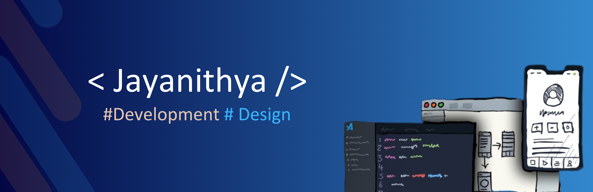

 

## Hi there 👋 , I'm Jayanithya Madhushani
#### Design & Development

I'm Jayanithya Madhushani from Srilanka, and I do content on Design and Development. I really enjoy learning languages and frameworks I also enjoy wireframing, ui, ux, and design in general.

 
  
          

## Languages and Tools
 

                  

## GitHub Stats
  

  
  

