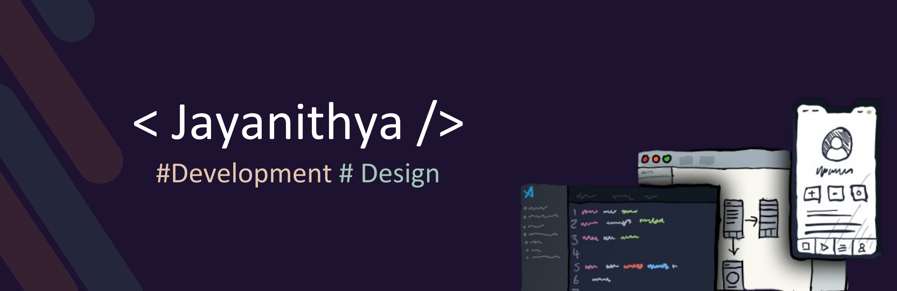

 
 

 
  Visitor count 
  

 

## Hi there 👋 , I'm Jayanithya Madhushani
#### Design & Development

I'm Jayanithya Madhushani from Srilanka, and I do content on Design and Development. I really enjoy learning languages and frameworks I also enjoy wireframing, ui, ux, and design in general.

 
- 📫 How to reach me: jayanithyamadhushani@icloud.com
 

          

## Skills & Experiences:

PYTHON / JAVA / C / C++/ C# / REACT JS / JS / HTML / CSS / PHP / FIGMA

## GitHub Stats:
  
  

###

